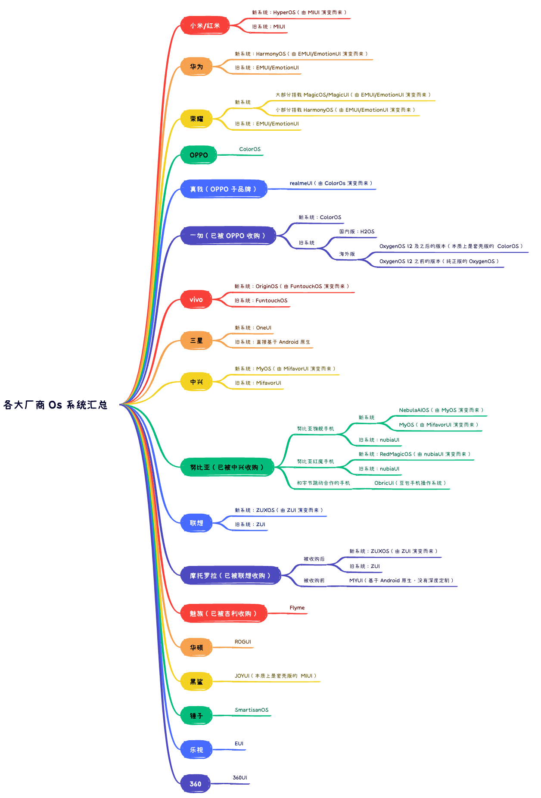

# 设备兼容框架


* 项目地址：[Github](https://github.com/getActivity/DeviceCompat)

* 博文地址：[尝试解决 Android 适配的最后一公里](https://juejin.cn/post/7540524749425180735)

* 可以扫码下载 Demo 进行演示或者测试，如果扫码下载不了的，[点击此处可直接下载](https://github.com/getActivity/DeviceCompat/releases/download/2.5/DeviceCompat.apk)


#### 框架介绍

* Android 碎片化至始至终是一个令人非常头疼的问题，特别为 [XXPermissions](https://github.com/getActivity/XXPermissions) 上面为不同的厂商做适配的时候就非常头疼，因为市面上能找到的开源库只能判断机型的品牌，而不能判断 Android 厂商定制的系统类型，用机型的品牌去做适配会导致出现误判的情况，例如在小米手机上面运行的厂商系统不一定是 MIUI 或者 HyperOS，也有可能是被人刷成了 Android 原生的系统或者其他，反过来也一样，我时常在想，要是有这么一个工具就好了，可以判断 Android 厂商系统的类型及获取厂商系统的版本号，这样就很方便我们做 Android 适配，于是 [DeviceCompat](https://github.com/getActivity/DeviceCompat) 就诞生了，可以轻松识别各种国内外手机厂商和系统版本，**帮助大家解决 Android 适配最后一公里的问题**。

* 截至到目前，我是行业内第一个也是唯一一个开源这套方案的人，在这里先感谢网上的同行分享的各种方法和思路，让我在开发的过程中少走了很多弯路，另外我也很能理解为什么行业内一直没有人愿意站出来开源这种框架，因为过程非常麻烦，这不仅仅是一个技术问题，还是一个苦活，因为要针对成千上万的机型进行适配。

  

   

* 用一张图带你梳理 Android 各大厂商 Os 系统



#### 框架亮点

* 支持识别各种定制 Android 系统（HarmonyOS、MagicOS、MIUI、HyperOS、ColorOS、OriginOS 等）

* 支持判断多种手机厂商品牌（华为、小米、OPPO、vivo、三星等）

* 使用简单，一行代码即可判断设备品牌、厂商系统类型、厂商系统版本

* 兼容性好，支持 Android 4.0 及以上系统

* 体积小巧，仅 **21 KB**，不会增加应用体积负担

#### 集成步骤

* 如果你的项目 Gradle 配置是在 `7.0` 以下，需要在 `build.gradle` 文件中加入

```groovy
allprojects {
    repositories {
        // JitPack 远程仓库：https://jitpack.io
        maven { url 'https://jitpack.io' }
    }
}
```

* 如果你的 Gradle 配置是 `7.0` 及以上，则需要在 `settings.gradle` 文件中加入

```groovy
dependencyResolutionManagement {
    repositories {
        // JitPack 远程仓库：https://jitpack.io
        maven { url 'https://jitpack.io' }
    }
}
```

* 配置完远程仓库后，在项目 app 模块下的 `build.gradle` 文件中加入远程依赖

```groovy
dependencies {
    // 设备兼容框架：https://github.com/getActivity/DeviceCompat
    implementation 'com.github.getActivity:DeviceCompat:2.5'
}
```

#### 框架 API 介绍

* 判断系统类型

```java
// 判断当前设备的厂商系统是否为 HyperOS（小米手机、红米手机的系统）
DeviceOs.isHyperOs();
// 判断当前设备的厂商系统是否为国内版本的 HyperOS
DeviceOs.isHyperOsByChina();
// 判断当前设备的厂商系统是否为国际版本的 HyperOS
DeviceOs.isHyperOsByGlobal();
// 判断当前设备的厂商系统开启了 HyperOS 的系统优化选项
DeviceOs.isHyperOsOptimization();

// 判断当前设备的厂商系统是否为 MIUI（小米手机、红米手机的老系统）
DeviceOs.isMiui();
// 判断当前设备的厂商系统是否为国内版本的 MIUI
DeviceOs.isMiuiByChina();
// 判断当前设备的厂商系统是否为国际版本的 MIUI
DeviceOs.isMiuiByGlobal();
// 判断当前设备的厂商系统是否开启了 MIUI 优化选项
DeviceOs.isMiuiOptimization();

// 判断当前设备的厂商系统是否为 realmeUI（真我手机的系统）
DeviceOs.isRealmeUi();

// 判断当前设备的厂商系统是否为 ColorOS（OPPO 手机、一加手机的系统）
DeviceOs.isColorOs();

// 判断当前设备的厂商系统是否为 OriginOS（vivo 手机的系统）
DeviceOs.isOriginOs();

// 判断当前设备的厂商系统是否为 FuntouchOS（vivo 手机的老系统）
DeviceOs.isFuntouchOs();

// 判断当前设备的厂商系统是否为 MagicOS 或者 MagicUI（荣耀手机的系统）
DeviceOs.isMagicOs();

// 判断当前设备的厂商系统是否为 HarmonyOS（华为手机、荣耀手机的系统）
DeviceOs.isHarmonyOs();

// 判断是否在 HarmonyOS NEXT（纯血鸿蒙）的卓易通或者出境易环境上运行
DeviceOs.isHarmonyOsNextAndroidCompatible();

// 判断当前设备的厂商系统是否为 EMUI 或者 EmotionUI（华为手机、荣耀手机的老系统）
DeviceOs.isEmui();

// 判断当前设备的厂商系统是否为 OneUI（三星手机的系统）
DeviceOs.isOneUi();

// 判断当前设备的厂商系统是否为 OxygenOS（一加手机的老系统，相当于 H2OS 的海外版）
DeviceOs.isOxygenOs();

// 判断当前设备的厂商系统是否为 H2OS（一加手机的老系统，相当于 OxygenOS 的国内版）
DeviceOs.isH2Os();

// 判断当前设备的厂商系统是否为 Flyme（魅族手机的系统）
DeviceOs.isFlyme();

// 判断当前设备的厂商系统是否为 RedMagicOS（努比亚红魔手机的系统，努比亚红魔是中兴旗下的子品牌）
DeviceOs.isRedMagicOs();

// 判断当前设备的厂商系统是否为 NebulaAIOS（努比亚手机的系统）
DeviceOs.isNebulaAiOs();

// 判断当前设备的厂商系统是否为 MyOS（中兴手机、努比亚手机的系统）
DeviceOs.isMyOs();

// 判断当前设备的厂商系统是否为 MifavorUI（中兴手机的老系统）
DeviceOs.isMifavorUi();

// 判断当前设备的厂商系统是否为 SmartisanOS（锤子手机的系统）
DeviceOs.isSmartisanOs();

// 判断当前设备的厂商系统是否为 EUI（乐视手机的系统）
DeviceOs.isEui();

// 判断当前设备的厂商系统是否为 ZUXOS（联想手机、摩托罗拉手机的系统）
DeviceOs.isZuxOs();

// 判断当前设备的厂商系统是否为 ZUI（联想手机、摩托罗拉手机的老系统）
DeviceOs.isZui();

// 判断当前设备的厂商系统是否为 nubiaUI（努比亚手机的老系统）
DeviceOs.isNubiaUi();

// 判断当前设备的厂商系统是否为 ObricUI（豆包手机的系统）
DeviceOs.isObricUi();

// 判断当前设备的厂商系统是否为 ROGUI（华硕手机的系统）
DeviceOs.isRogUi();

// 判断当前设备的厂商系统是否为 360UI（360 手机的系统）
DeviceOs.is360Ui();

// 获取当前设备的厂商系统名称
DeviceOs.getOsName();

// 获取经过美化的厂商系统版本名称
DeviceOs.getOsVersionName();

// 获取厂商系统版本的大版本号（如果获取不到则返回 -1）
DeviceOs.getOsBigVersionCode();
```

* 判断设备品牌

```java
// 判断当前设备的品牌是否为红米
DeviceBrand.isRedMi();

// 判断当前设备的品牌是否为小米
DeviceBrand.isXiaoMi();

// 判断当前设备的品牌是否为真我
DeviceBrand.isRealMe();

// 判断当前设备的品牌是否为一加
DeviceBrand.isOnePlus();

// 判断当前设备的品牌是否为 OPPO
DeviceBrand.isOppo();

// 判断当前设备的品牌是否为 vivo
DeviceBrand.isVivo();

// 判断当前设备的品牌是否为荣耀
DeviceBrand.isHonor();

// 判断当前设备的品牌是否为华为
DeviceBrand.isHuaWei();

// 判断当前设备的品牌是否为魅族
DeviceBrand.isMeiZu();

// 判断当前设备的品牌是否为三星
DeviceBrand.isSamsung();

// 判断当前设备的品牌是否为努比亚
DeviceBrand.isNubia();

// 判断当前设备的品牌是否为中兴
DeviceBrand.isZte();

// 判断当前设备的品牌是否为摩托罗拉
DeviceBrand.isMotorola();

// 判断当前设备的品牌是否为联想
DeviceBrand.isLenovo();

// 判断当前设备的品牌是否为华硕
DeviceBrand.isAsus();

// 判断当前设备的品牌是否为索尼
DeviceBrand.isSony();

// 判断当前设备的品牌是否为锤子
DeviceBrand.isSmartisan();

// 判断当前设备的品牌是否为乐视
DeviceBrand.isLeEco();

// 判断当前设备的品牌是否为 360
DeviceBrand.is360();

// 判断当前设备的品牌是否为酷派
DeviceBrand.isCoolPad();

// 判断当前设备的品牌是否为 LG
DeviceBrand.isLg();

// 判断当前设备的品牌是否为 HTC
DeviceBrand.isHtc();

// 判断当前设备的品牌是否为金立
DeviceBrand.isGionee();

// 判断当前设备的品牌是否为传音
DeviceBrand.isTranssion();

// 判断当前设备的品牌是否为朵唯
DeviceBrand.isDoov();

// 判断当前设备的品牌是否为飞利浦
DeviceBrand.isPhilips();

// 判断当前设备的品牌是否为黑鲨
DeviceBrand.isBlackShark();

// 判断当前设备的品牌是否为海信
DeviceBrand.isHisense();

// 判断当前设备的品牌是否为天语
DeviceBrand.isKTouch();

// 判断当前设备的品牌是否为美图
DeviceBrand.isMeiTu();

// 判断当前设备的品牌是否为诺基亚
DeviceBrand.isNokia();

// 判断当前设备的品牌是否为 Google
DeviceBrand.isGoogle();

// 获取当前设备的品牌名称
DeviceBrand.getBrandName();
```

* 获取设备的市场名称

```java
// 例如：Xiaomi Pad 5
DeviceMarketName.getMarketName(@NonNull Context context);
```

* 获取和判断系统属性相关的方法

```java
// 获取单个系统属性值
SystemPropertyCompat.getSystemPropertyValue((@Nullable String key);

// 获取多个系统属性值
SystemPropertyCompat.getSystemPropertyValues(@Nullable String[] keys);

// 获取多个系统属性中的任一一个值
SystemPropertyCompat.getSystemPropertyAnyOneValue(@Nullable String[] keys);

// 判断某个系统属性是否存在
SystemPropertyCompat.isSystemPropertyExist(@Nullable String key);

// 判断多个系统属性是否有任一一个存在
SystemPropertyCompat.isSystemPropertyAnyOneExist(@Nullable String[] keys);
```

#### 需要大家协助

* 这个框架一经发布深受大家的喜欢，但是很快我就遇到了瓶颈，这个瓶颈不是技术导致的，而是我手头没有那么多设备，为了 DeviceCompat 能够做得更好（判断更加精准），现在需要征集大家手机的系统属性，目前已经收集了上百个机型的系统属性，但是这远远不够，需要借助大家的力量一起完善，参与地址：[AndroidSystemPropertyCollect](https://github.com/getActivity/AndroidSystemPropertyCollect)

#### 作者的其他开源项目

* 安卓技术中台：[AndroidProject](https://github.com/getActivity/AndroidProject)  

* 安卓技术中台 Kt 版：[AndroidProject-Kotlin](https://github.com/getActivity/AndroidProject-Kotlin)  

* 权限框架：[XXPermissions](https://github.com/getActivity/XXPermissions)  

* 吐司框架：[Toaster](https://github.com/getActivity/Toaster)  

* 网络框架：[EasyHttp](https://github.com/getActivity/EasyHttp)  

* 标题栏框架：[TitleBar](https://github.com/getActivity/TitleBar)  

* 悬浮窗框架：[EasyWindow](https://github.com/getActivity/EasyWindow)  

* ShapeView 框架：[ShapeView](https://github.com/getActivity/ShapeView)  

* ShapeDrawable 框架：[ShapeDrawable](https://github.com/getActivity/ShapeDrawable)  

* 语种切换框架：[MultiLanguages](https://github.com/getActivity/MultiLanguages)  

* Gson 解析容错：[GsonFactory](https://github.com/getActivity/GsonFactory)  

* 日志查看框架：[Logcat](https://github.com/getActivity/Logcat)  

* 嵌套滚动布局框架：[NestedScrollLayout](https://github.com/getActivity/NestedScrollLayout)  

* Android 版本适配：[AndroidVersionAdapter](https://github.com/getActivity/AndroidVersionAdapter)  

* Android 代码规范：[AndroidCodeStandard](https://github.com/getActivity/AndroidCodeStandard)  

* Android 资源大汇总：[AndroidIndex](https://github.com/getActivity/AndroidIndex)  

* Android 开源排行榜：[AndroidGithubBoss](https://github.com/getActivity/AndroidGithubBoss)  

* Studio 精品插件：[StudioPlugins](https://github.com/getActivity/StudioPlugins)  

* 表情包大集合：[EmojiPackage](https://github.com/getActivity/EmojiPackage)  

* AI 资源大汇总：[AiIndex](https://github.com/getActivity/AiIndex)  

* 省市区 Json 数据：[ProvinceJson](https://github.com/getActivity/ProvinceJson)  

* Markdown 语法文档：[MarkdownDoc](https://github.com/getActivity/MarkdownDoc)  

#### 微信公众号：Android轮子哥


#### Android 技术 Q 群：10047167

#### 如果您觉得我的开源库帮你节省了大量的开发时间，请扫描下方的二维码随意打赏，要是能打赏个 10.24 :monkey_face:就太:thumbsup:了。您的支持将鼓励我继续创作:octocat:（[点击查看捐赠列表](https://github.com/getActivity/Donate)）

 

## License

```text
Copyright 2025 Huang JinQun

Licensed under the Apache License, Version 2.0 (the "License");
you may not use this file except in compliance with the License.
You may obtain a copy of the License at

   http://www.apache.org/licenses/LICENSE-2.0

Unless required by applicable law or agreed to in writing, software
distributed under the License is distributed on an "AS IS" BASIS,
WITHOUT WARRANTIES OR CONDITIONS OF ANY KIND, either express or implied.
See the License for the specific language governing permissions and
limitations under the License.
```